# iOS 手势学习

## 本文要解答的几个问题 

1. Touch 事件是怎么传递的?
1. CASE: 父 View A 有子 View B 和 C, B 和 C frame 一样, 如果需要 B 的左半边和 C 的右半边都能响应点击, 需要怎么处理?
1. UITouch 和 UIEvent 是什么关系? 和 UIGestureRecognizer 又是什么关系?
1. Touch, UIControl 和 UIGestureRecognizer 该如何选择?
1. 手势该如何选择?
1. 多个手势会存在冲突吗? 如何处理冲突?
1. 如何自定义手势?
1. ScrollView 中的手势该如何处理?
1. TableView/CollectionView 中 Cell 上的手势该如何处理?

## Touch 事件是怎么传递的?

### hitTesting 流程

hitTest 采用的是"逆前序深度遍历", 从最底部的 window 开始遍历, 具体伪代码如下:

```
- (UIView *)hitTest:(CGPoint)point withEvent:(UIEvent *)event { 
    if (/* point is in our bounds */) {
        for (/* each subview, in reverse order */) {
            UIView *hitView = /* recursive call on subview */
            if (hitView != nil) {
                return hitView;
            } 
        }
        return self; 
    }
    return nil; 
}
```

那么 hitTest 方法找到的是最顶层可以响应事件的子 View, 后续事件会派发给该 View.

### 点击响应区域处理

从上面的伪代码可以看到, 最开始的判断就是 `point is in our bounds` 的逻辑, 那么这个对应到 UIView 中的方法是:

```
- (BOOL)pointInside:(CGPoint)point withEvent:(UIEvent *)event {
    /* point is in our bounds */
}
```

对应的可以参考 `TDTouchViewController` 中的例子.

### 事件分发流程

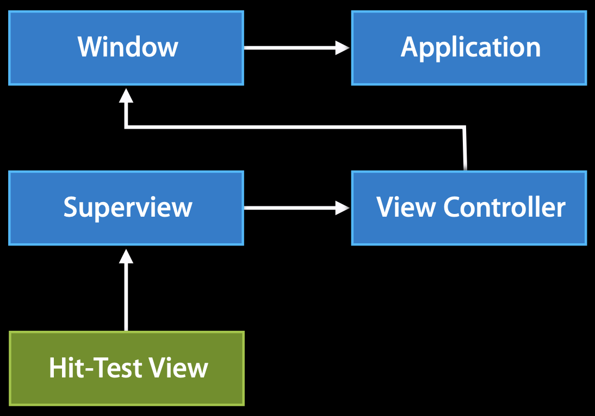

### 以 Single Touch 为例

*touch down*
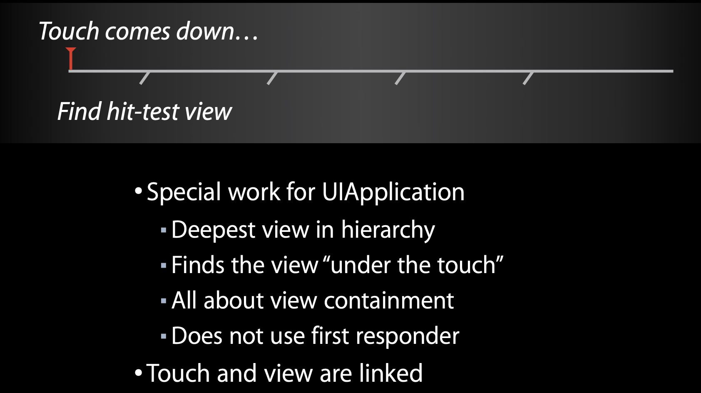

*touch began*
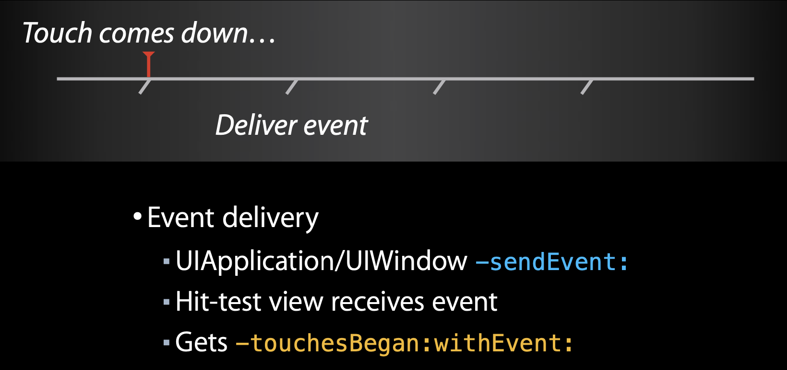

*touch moves*
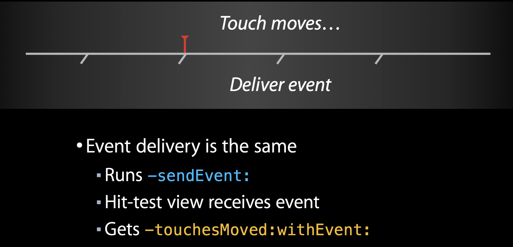

*touch ended*
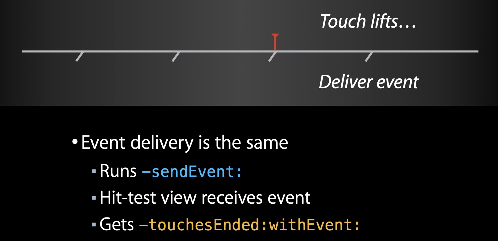

*touch cancelled*
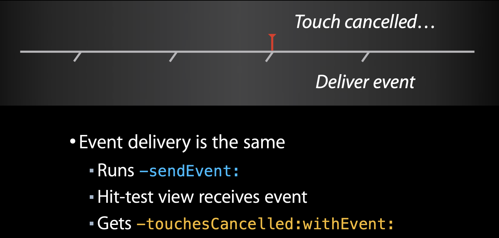

*summary*
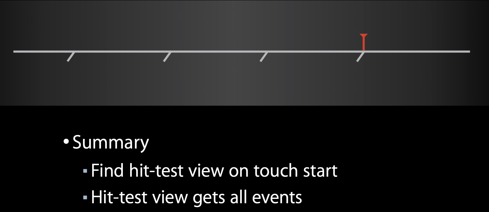

### 加入手势以后

*touch down*
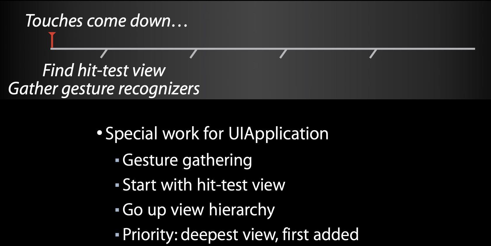

*touch began*
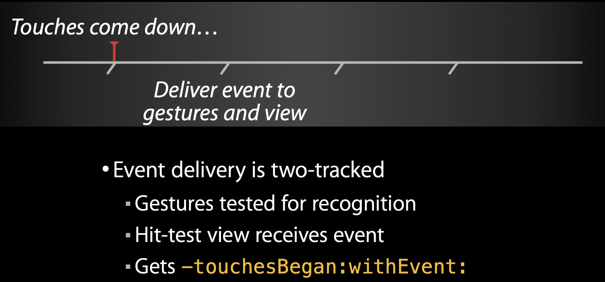

*touch move*
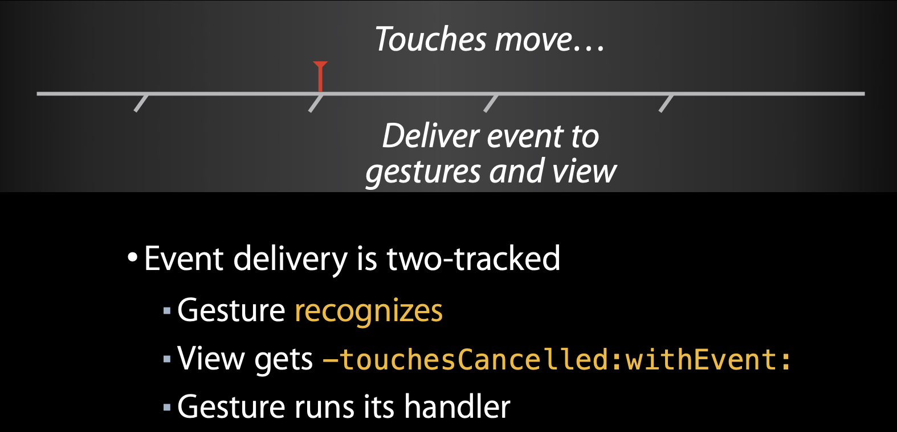

*touch move again*
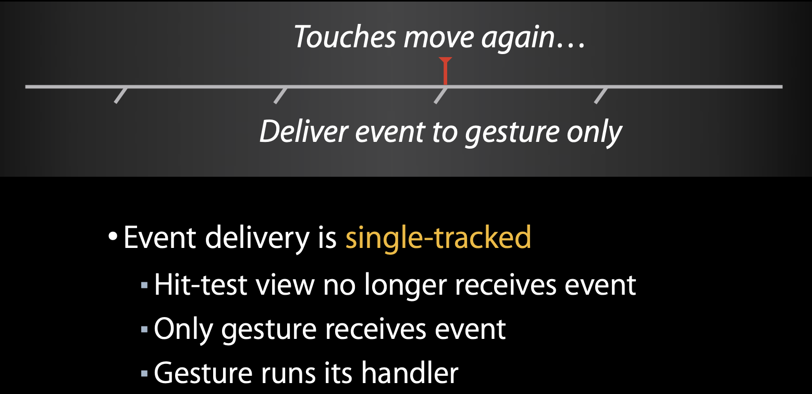

*touch lift*
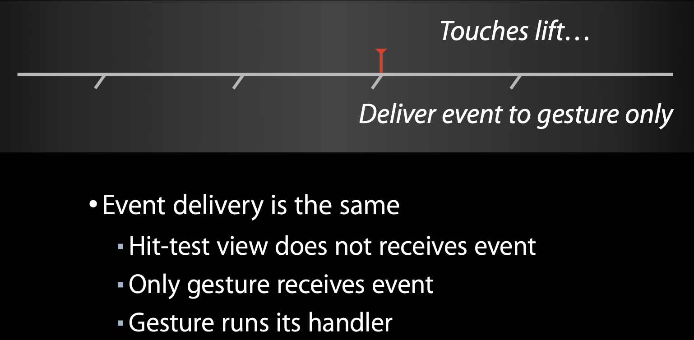

## 为什么需要手势? 


## Tips

### lldb 打印 

#### 方法断点入口打印

```
po $arg1  // 调用对象
po (SEL)$arg2 // 方法签名
po $arg3 // 第一个参数
po $arg4 // 第二个参数
... // 以此类推
```

#### 系统方法汇编代码点断打印
对于系统方法执行过程中, 想要对某些方法体内部的方法进行调用的话, 可以直接对汇编代码进行断点, 然后打印寄存器中的变量.
参考: [汇编基础（通用寄存器）](https://www.jianshu.com/p/842fbda059e1)
第一个参数: RDI
第二个参数: RSI
第三个参数: RDX
第四个参数: RCX
第五个参数: R8
第六个参数: R9
超过7个以及上的参数会被分配到进程的栈区
返回值: RAX

所以使用 po 进行查看, 入参查看, 断点在 `callq` 之前:

```
po $rdi // 第一个参数
po (SEL)$rsi // 第二个参数
... // 以此类推
```

返回值查看, 断点在 `callq` 下一行:

```
po $rax // 查看返回值
```

## iOS 手势原生响应机制处理流程

在 com.apple.uikit.eventfetch-thread 线程下苹果注册了一个 Source1(基于 mach port 的)用来接收系统事件, 其回调函数为 __IOHIDEventSystemClientQueueCallback()，"HID" 是 Human Interface Devices "人机交互" 的首字母缩写.
当一个硬件事件(触摸/锁屏/摇晃等)发生后, 首先由 IOKit.framework 生成一个 IOHIDEvent 事件并由 SpringBoard 接收. 这个过程的详细情况可以参考 [IOHIDFamily](http://iphonedevwiki.net/index.php/IOHIDFamily). 
SpringBoard 只接收按键(锁屏/静音等), 触摸, 加速, 接近传感器等几种 Event. 随后用 mach port 转发给需要的 App 进程. 随后苹果注册的那个 Source1 就会触发回调, 并调用 _UIApplicationHandleEventQueue 进行应用内部的分发(Xcode 12 和 iOS 14 下是：__eventQueueSourceCallback).
_UIApplicationHandleEventQueue 会把 IOHIDEvent 处理并包装成 UIEvent 进行处理或分发，其中包括识别 UIGesture/处理屏幕旋转/发送给 UIWindow 等, 通常事件比如 UIButton 点击,touchesBegin/Move/End/Cancel 事件都是在这个回调中完成的. [深入理解RunLoop](https://blog.ibireme.com/2015/05/18/runloop/)

### com.apple.uikit.eventfetch-thread 线程

-[UIEventFetcher threadMain] 方法会单起了一个线程, 该线程有自己的 RunLoop, 是一个常驻线程, Xcode Debug 模式下可以挂起线程进行测试, 所有的点击事件都不响应了. 

IOHIDEventSystemClientScheduleWithRunLoop 函数执行 RunLoop
IOHIDEventSystemClientRegisterEventCallback 函数注册回调

-[UIEventFetcher _setupFilterChain] // 设置 __UILogGetCategoryImpl

### 点击触发 Source1

#### 起点分析

Source1 是基于 mach port 的, 用来接收系统事件. 
从 RunLoop 源码分析应该是 __CFRunLoopModeFindSourceForMachPort 触发的, 但是断点并没有执行.
从其上一步 CFDictionaryGetValue 调用分析, 都是通过 port 取 CFRunLoopSource, 和 __CFRunLoopModeFindSourceForMachPort 实现一致, 初步推测可能是编译器给优化掉了, 但是实现并没有变:

断点 CFDictionaryGetValue 函数, 取 $arg1 (即字典本身), 取 allValues:
<__NSArrayI_Transfer 0x283d96d00>(
<CFRunLoopSource 0x2808a0540 [0x1ea4f5b20]>{signalled = No, valid = Yes, order = 0, context = <CFMachPort 0x280aa42c0 [0x1ea4f5b20]>{valid = Yes, port = 480f, source = 0x2808a0540, callout = <redacted> (0x1a3575770), context = <CFMachPort context 0x125e056d0>}},
<CFRunLoopSource 0x2808a0600 [0x1ea4f5b20]>{signalled = No, valid = Yes, order = 0, context = <CFMachPort 0x280aa4370 [0x1ea4f5b20]>{valid = Yes, port = 3807, source = 0x2808a0600, callout = <redacted> (0x1a3575930), context = <CFMachPort context 0x125e056d0>}},
<CFRunLoopSource 0x2808a06c0 [0x1ea4f5b20]>{signalled = No, valid = Yes, order = 1, context = <CFMachPort 0x280aa0160 [0x1ea4f5b20]>{valid = Yes, port = 3203, source = 0x2808a06c0, callout = <redacted> (0x1a358ba48), context = <CFMachPort context 0x2816a2290>}}
)

打印 $arg2 port值为 18447 转化成 16进制 = 0x480F, 在字典中能够找到:
(lldb) p $arg2
(unsigned long) $14 = 18447

#### 触发 Source1

然后触发 __CFRunLoopDoSource1
__CFRunLoopDoSource1

__CFRUNLOOP_IS_CALLING_OUT_TO_A_SOURCE1_PERFORM_FUNCTION__

__CFMachPortPerform

#### 转 Source0

```
__IOHIDEventSystemClientQueueCallback
    -[UIEventFetcher _receiveHIDEventInternal:] // 接收事件
    (lldb) po $arg3
    +++++++++++++++++++++++++++++++++++++++++++++++++++++++++++++++++++++++++++
    SenderID:            0x0acefade00000002
    BuiltIn:             1
    PrimaryUsagePage:    13
    PrimaryUsage:        4
    DeviceUsagePairs:   
    DeviceUsagePage:     13
    DeviceUsage:         4
    +++++++++++++++++++++++++++++++++++++++++++++++++++++++++++++++++++++++++++

    (lldb) po [$arg3 class]
    HIDServiceClient

    __30-[UIEventFetcher filterEvents]_block_invoke // 过滤事件

    -[UIEventFetcher signalEventsAvailableWithReason:filteredEventCount:] // 发送事件

    -[UIEventDispatcher eventFetcherDidReceiveEvents:] // 派发事件
    (lldb) po $arg3
    <UIEventFetcher: 0x60000074c100>

    // 查看汇编代码, 可以得到, 最终在这个函数里面将 Source1 转化为了 Source0
    void -[UIEventDispatcher eventFetcherDidReceiveEvents:](int arg0) {
            CFRunLoopSourceSignal(*(arg0 + 0x20));
            CFRunLoopWakeUp(*(arg0 + 0x28));
            return;
    }
```

### 主线程

#### 处理 Source0

主线程 RunLoop 被唤醒后, 开始处理 Source0

__CFRunLoopDoSource0

__CFRUNLOOP_IS_CALLING_OUT_TO_A_SOURCE0_PERFORM_FUNCTION__

__eventFetcherSourceCallback

-[UIEventFetcher drainEventsIntoEnvironment:] 

__processEventQueue // 关键函数

#### 确定响应事件的 View

整个主要的逻辑都在 __processEventQueue 里面, 通过汇编查看这个函数体非常的大, 也很复杂, 主要挑几个重点看一下吧

-[UIEventEnvironment UIKitEventForHIDEvent:] // 会将 HIDEvent -> UITouchesEvent

_UIEventHIDUIWindowForHIDEvent // 通过 HIDEvent 获取处理该事件的 window
(lldb) po $rax
<TDWindow: 0x7fe03140aec0; baseClass = UIWindow; frame = (0 0; 428 926); gestureRecognizers = <NSArray: 0x60000185a610>; layer = <UIWindowLayer: 0x60000165cb40>>

_UIEventHIDEnumerateChildren // 遍历子事件, 该函数有三个参数, 遍历出子事件后交由 ____updateTouchesWithDigitizerEventAndDetermineIfShouldSend_block_invoke 处理

```
(lldb) po $arg1
+++++++++++++++++++++++++++++++++++++++++++++++++++++++++++++++++++++++
Timestamp:           37267037826054
Total Latency:       1883854716 us
SenderID:            0x0ACEFADE00000002 NON KERNEL SENDER
BuiltIn:             1
AttributeDataLength: 120
AttributeData:       02 00 00 00 69 00 00 00 0a 59 0d 00 00 00 00 11 00 00 00 00 00 00 00 00 19 00 00 00 00 00 00 00 00 21 1c fc de 35 61 32 e2 40 28 01 30 00 38 00 42 31 08 01 10 35 18 00 20 00 2d 00 00 00 00 31 aa aa aa aa aa 0a 6f 40 39 55 55 55 55 55 5d 83 40 41 aa aa aa aa aa 0a 6f 40 49 55 55 55 55 55 5d 83 40 12 0c 22 06 08 b6 ea 9d 86 01 28 00 30 00 00 00 00 00 00 00 00 
ValueType:           Absolute
EventType:           Digitizer
Flags:               0xa0015
DisplayIntegrated:   1
TransducerType:      Hand
TransducerIndex:     0
Identity:            0
EventMask:           2
Events:              Touch 
ButtonMask:          0
Range:               0
Touch:               1
Pressure:            0.000000
AuxiliaryPressure:   0.000000
Twist:               0.000000
GenerationCount:     0
WillUpdateMask:      00000000
DidUpdateMask:       00000000
X:                   0.000000
Y:                   0.000000
Z:                   0.000000
TiltX:               0.000000
TiltY:               0.000000
ChildEvents:        
    -----------------------------------------------------------------------
    ValueType:           Absolute
    EventType:           Digitizer
    Flags:               0xb0001
    DisplayIntegrated:   1
    TransducerType:      Finger
    TransducerIndex:     1
    Identity:            2
    EventMask:           3
    Events:              Range Touch     
    ButtonMask:          0
    Range:               1
    Touch:               1
    Pressure:            0.000000
    AuxiliaryPressure:   0.000000
    Twist:               90.000000
    GenerationCount:     0
    WillUpdateMask:      00000000
    DidUpdateMask:       00000000
    X:                   248.333328
    Y:                   619.666656
    Z:                   0.000000
    Quality:             1.500000
    Density:             1.500000
    Irregularity:        0.000000
    MajorRadius:         4.599991
    MinorRadius:         3.799988
    Accuracy:            0.000000
    -----------------------------------------------------------------------
+++++++++++++++++++++++++++++++++++++++++++++++++++++++++++++++++++++++

(lldb) po $arg2
11

(lldb) po $arg3
<__NSStackBlock__: 0x7ffeef625478>
 signature: "v32@?0^{__IOHIDEvent=}8Q16^B24"
 invoke   : 0x7fff2473c958 (/Applications/Xcode.app/Contents/Developer/Platforms/iPhoneOS.platform/Library/Developer/CoreSimulator/Profiles/Runtimes/iOS.simruntime/Contents/Resources/RuntimeRoot/System/Library/PrivateFrameworks/UIKitCore.framework/UIKitCore`____updateTouchesWithDigitizerEventAndDetermineIfShouldSend_block_invoke)
 copy     : 0x7fff23cece6b (/Applications/Xcode.app/Contents/Developer/Platforms/iPhoneOS.platform/Library/Developer/CoreSimulator/Profiles/Runtimes/iOS.simruntime/Contents/Resources/RuntimeRoot/System/Library/PrivateFrameworks/UIKitCore.framework/UIKitCore`__copy_helper_block_e8_32r40r)
 dispose  : 0x7fff23cecea3 (/Applications/Xcode.app/Contents/Developer/Platforms/iPhoneOS.platform/Library/Developer/CoreSimulator/Profiles/Runtimes/iOS.simruntime/Contents/Resources/RuntimeRoot/System/Library/PrivateFrameworks/UIKitCore.framework/UIKitCore`__destroy_helper_block_e8_32r40r)
```

以下是 hitTest 方法触发的调用栈
____updateTouchesWithDigitizerEventAndDetermineIfShouldSend_block_invoke.43
    -[UIWindow _targetWindowForPathIndex:atPoint:forEvent:windowServerHitTestWindow:]
        +[UIWindow _hitTestToPoint:forEvent:windowServerHitTestWindow:]
            -[UIWindowScene _topVisibleWindowPassingTest:]
                -[UIWindowScene _enumerateWindowsIncludingInternalWindows:onlyVisibleWindows:asCopy:stopped:withBlock:]
                    __46-[UIWindowScene _topVisibleWindowPassingTest:]_block_invoke
                        __63+[UIWindow _hitTestToPoint:forEvent:windowServerHitTestWindow:]_block_invoke
                            -[UIWindow _hitTestLocation:inScene:withWindowServerHitTestWindow:event:]
                                -[UIView(Geometry) _hitTest:withEvent:windowServerHitTestWindow:]
                                    -[UIView(Geometry) hitTest:withEvent:]

-[UIEventEnvironment _setTouchMap:forWindow:] // 将 UITouch 缓存到当前 Window 中, 下面事件分发的时候需要使用

-[UITouch _willBeDispatchedAsEnded] // 点击为 end 状态时会触发

[[_UIRemoteKeyboards sharedRemoteKeyboards] peekApplicationEvent:] // 发送给键盘的 Window 进行处理

// 系统手势更新 ?
BKSHIDEventGetSystemGestureStatusFromDigitizerEvent

__sendSystemGestureLatentClientUpdate


#### 事件分发

```
// 先由 UIApplication sendEvent:
- [UIApplication sendEvent:]

// 调用 UIWindow sendEvent:
- [UIWindow sendEvent:]
    -[UIWindow _sendTouchesForEvent:]
        -[UITouchesEvent _viewsForWindow:] // 获取 Touch 的 View
            -[UITouchesEvent touchesForWindow:] // 从 _keyedTouchesByWindow 这个字典里面获取 UITouch, key 是 Window, Value 是 Touch, 如果能取到 Touch, 走下面的方法
        -[UITouchesEvent _touchesForView:withPhase:] 
            -[UITouchesEvent touchesForView:] // 从 _keyedTouches 字典里面获取 UITouch
            // 通过上面获取的 View & Touch 调用 touchesBegan/touchesMoved/touchesEnded/touchesCancelled 等方法
```

## hitTest 流程分析

我们先从汇编代码看下 hitTest 方法的

主要核心代码如下
```
if (__UIViewIgnoresTouchEvents(r13, rbx & 0xff) == 0x0) {
        xmm0 = intrinsic_movsd(xmm0, var_30);
        intrinsic_movsd(xmm1, var_38);
        if ([r13 pointInside:r14 withEvent:___Block_byref_object_dispose_] != 0x0) {
                rax = *ivar_offset(_viewFlags);
                rsi = 0x0;
                r15 = 0x400 & *(r13 + rax);
                if (r15 == 0x0) {
                        rsi = r13;
                }
                objc_storeStrong(var_68 + 0x28, rsi);
                rax = [r13 subviews];
                rax = [rax retain];
                var_C0 = *__NSConcreteStackBlock;
                *(&var_C0 + 0x8) = 0xffffffffc2000000;
                *(&var_C0 + 0x10) = ___38-[UIView(Geometry) hitTest:withEvent:]_block_invoke;
                *(&var_C0 + 0x18) = ___block_descriptor_73_e8_32s40s48r_e15_v32?08Q16^B24l;
                *(int8_t *)(&var_C0 + 0x48) = r15 >> 0xa;
                *(&var_C0 + 0x20) = [r14 retain];
                xmm0 = intrinsic_movsd(xmm0, var_30);
                *(&var_C0 + 0x38) = intrinsic_movsd(*(&var_C0 + 0x38), xmm0);
                *(&var_C0 + 0x40) = intrinsic_movsd(*(&var_C0 + 0x40), intrinsic_movsd(xmm0, var_38));
                *(&var_C0 + 0x28) = r13;
                *(&var_C0 + 0x30) = r12;
                [rax enumerateObjectsWithOptions:0x2 usingBlock:&var_C0];
                [rax release];
                [var_A0 release];
        }
}
```
1. 如果 __UIViewIgnoresTouchEvents 判断 View 忽略事件, 则不处理
2. - (BOOL)pointInside:(CGPoint)point withEvent:(UIEvent *)event 判断下, 点击是否在 View 内
3. 遍历 subviews 调用 ___38-[UIView(Geometry) hitTest:withEvent:]_block_invoke 
4. ___38-[UIView(Geometry) hitTest:withEvent:]_block_invoke 会再调用 -[UIView(Geometry) _hitTest:withEvent:windowServerHitTestWindow:] 方法
5. -[UIView(Geometry) _hitTest:withEvent:windowServerHitTestWindow:] 内会再调用子 View 的 hitTest:withEvent: 方法
6. 如上, 重复此过程, 最终遍历到符合条件的 View 并返回

这里有个细节: hitTest 采用的是"逆前序深度遍历".

## 手势的处理
这里以 Tap 手势为例, 同样的主要的逻辑处理在 `__processEventQueue` 函数里面

____updateTouchesWithDigitizerEventAndDetermineIfShouldSend_block_invoke.100
    _AddTouchToEventAndDetermineIfNeedsCancel
        -[UITouchesEvent _addTouch:forDelayedDelivery:]
            -[UITouchesEvent _addGestureRecognizersForView:toTouch:]
                -[UITouchesEvent _addGestureRecognizersForView:toTouch:forContinuation:]
                    -[UITouchesEvent _collectGestureRecognizersForView:withBlock:]
                        __62-[UITouchesEvent _collectGestureRecognizersForView:withBlock:]_block_invoke
                            __72-[UITouchesEvent _addGestureRecognizersForView:toTouch:forContinuation:]_block_invoke
                                -[UIGestureRecognizer _shouldReceiveTouch:forEvent:recognizerView:]

### UITouch 和手势的关系

UITouch 会持有手势, 具体是在 `-[UITouchesEvent _addGestureRecognizersForView:toTouch:]` 方法里面添加进去的

我们先获取 UITouch 的地址
(lldb) p $arg4
(unsigned long) $0 = 140359228234352

打印下 `gestureRecognizers`, 此时我们看到为空
(lldb) po [(UITouch *)140359228234352 gestureRecognizers]
 nil

断点执行到 `-[UITouchesEvent _addGestureRecognizersForView:toTouch:forContinuation:]` 方法之后, 再打印 `gestureRecognizers` 已经有值了
(lldb) po [(UITouch *)140359228234352 gestureRecognizers]
<__NSArrayI 0x600003601680>(
<TDTapGestureRecognizer: 0x7fa7f0812d00; baseClass = UITapGestureRecognizer; state = Possible; view = <TDView 0x7fa7f0812b90>; target= <(action=tap:, target=<TDGestureViewController 0x7fa7f0814fc0>)>>,
<TDLongPressGestureRecognizer: 0x7fa7f0816070; baseClass = UILongPressGestureRecognizer; state = Possible; view = <TDView 0x7fa7f0812b90>; target= <(action=longPress:, target=<TDGestureViewController 0x7fa7f0814fc0>)>; numberOfTapsRequired = 0; minimumPressDuration =  1>,
<_UIParallaxTransitionPanGestureRecognizer: 0x7fa7edd0c4c0; state = Possible; delaysTouchesBegan = YES; view = <UILayoutContainerView 0x7fa7edd09e30>; target= <(action=handleNavigationTransition:, target=<_UINavigationInteractiveTransition 0x7fa7edd08dd0>)>>,
<_UISystemGestureGateGestureRecognizer: 0x7fa7edd08450; state = Possible; delaysTouchesEnded = NO; view = <TDWindow 0x7fa7edd09b40>>,
<_UISystemGestureGateGestureRecognizer: 0x7fa7edd07ae0; state = Possible; delaysTouchesBegan = YES; view = <TDWindow 0x7fa7edd09b40>>
)

那么手势是在什么时候添加到 UITouch 里面的呢? 参考如下调用:
__72-[UITouchesEvent _addGestureRecognizersForView:toTouch:forContinuation:]_block_invoke
    -[UITouch _addGestureRecognizer:]

### 手势更新

这里以 Pan 手势为例, Pan 手势触发时候的调用栈:

```
-[UIApplication sendEvent:]
    -[UIWindow sendEvent:]
        -[UIGestureEnvironment _updateForEvent:window:]
            _UIGestureEnvironmentUpdate
                -[UIGestureRecognizer _updateGestureForActiveEvents]
                    _UIGestureRecognizerSendActions
                        _UIGestureRecognizerSendTargetActions
                            -[UIGestureRecognizerTarget _sendActionWithGestureRecognizer:]
```

这里有个关键角色 `UIGestureEnvironment`, 首先我们看看 `UIGestureEnvironment` 是个啥. 
先看下 dump 出的头文件: https://developer.limneos.net/?ios=11.1.2&framework=UIKit.framework&header=UIGestureEnvironment.h
这个是 iOS 11.1.2 的头文件, 有些私有方法已经变更了, 不过还是可以大致推测下.
从属性和方法来看, 手势的集中管理就在这个类中.

我们简单验证下, 将以下两个方法加一下断点:
-[UIGestureEnvironment addGestureRecognizer:]
-[UIGestureEnvironment removeGestureRecognizer:]

添加:
-[UIView addGestureRecognizer:]
    -[UIView _addGestureRecognizer:atEnd:]
        -[UIGestureEnvironment addGestureRecognizer:]
移除:
-[UIView dealloc]
    -[UIView(UIViewGestures) removeAllGestureRecognizers]
        -[UIGestureEnvironment removeGestureRecognizer:]

按此判断, 手势最终都会在 UIGestureEnvironment 里面进行统一管理. 

从调用栈可知, UIGenerateEnviromonent 需要找出对应的 GestureRecognizer 进行手势处理, 可以看下 hooper 的汇编伪代码:

```
loc_7276d9:
    var_5E8 = objc_opt_new(@class(NSMutableOrderedSet));
    var_600 = @selector(removeAllObjects);
    while ([*(var_628 + 0x10) count] != 0x0) {
            var_600 = @selector(removeAllObjects);
            rax = [*(var_628 + 0x10) allObjects];
            rax = [rax retain];
            r14 = [[rax sortedArrayUsingSelector:@selector(_depthFirstViewCompare:)] retain];
            // ... 以下代码省略
    }
    // ... 以下代码省略
```

其中 var_628 变量就是 UIGestureEnvironment, 偏移 0x10 就是第二个实例变量对应 `_gestureRecognizersNeedingUpdate`, 在对应 `rax = [*(var_628 + 0x10) allObjects];` 代码处断点, 我们打印下
```
(lldb) po $rax
<UIGestureEnvironment: 0x60000144c000>

(lldb) po [$rax valueForKeyPath:@"_gestureRecognizersNeedingUpdate"]
{(
    <_UIParallaxTransitionPanGestureRecognizer: 0x7fbdde7111e0; state = Failed; delaysTouchesBegan = YES; view = <UILayoutContainerView 0x7fbdde70c580>; target= <(action=handleNavigationTransition:, target=<_UINavigationInteractiveTransition 0x7fbdde7110a0>)>>,
    <_UISystemGestureGateGestureRecognizer: 0x7fbdde70e680; state = Possible; delaysTouchesEnded = NO; view = <TDWindow 0x7fbdde70ec40>>,
    <TDPanGestureRecognizer: 0x7fbdde70c070; baseClass = UIPanGestureRecognizer; state = Possible; view = <TDView 0x7fbdde717fa0>; target= <(action=pan:, target=<TDPanViewController 0x7fbdde424bd0>)>>,
    <_UISystemGestureGateGestureRecognizer: 0x7fbdde70b470; state = Failed; delaysTouchesBegan = YES; view = <TDWindow 0x7fbdde70ec40>>
)}
```
中间还会对手势有一些额外的处理, 然后将手势添加到上述的 `NSMutableOrderedSet` 中, 这里不详细讲了, 定位起来也比较麻烦.
然后遍历 `NSMutableOrderedSet` 调用 `-[UIGestureRecognizer _updateGestureForActiveEvents]`
```
rax = [var_5E8 retain];
r14 = rax;
rax = _objc_msgSend_16fe878(rax, var_618, &var_8B0, &var_5B0, 0x10);
r12 = rax;
if (rax != 0x0) {
        r15 = *var_8A0;
        do {
                rbx = 0x0;
                do {
                        if (*var_8A0 != r15) {
                                objc_enumerationMutation(r14);
                        }
                        -[UIGestureRecognizer _updateGestureForActiveEvents](*(var_8A8 + rbx * 0x8));
                        rbx = rbx + 0x1;
                } while (rbx < r12);
                var_618 = @selector(countByEnumeratingWithState:objects:count:);
                rax = (*_objc_msgSend)(r14, var_618);
                r12 = rax;
        } while (rax != 0x0);
}
```
断点 `_UIGestureRecognizerSendTargetActions` 看下, 连续触发了几次, 其中有 `state = Began` -> `state = Changed` 的转变
```
(lldb) po $arg1
<TDPanGestureRecognizer: 0x7fbdde70c070; baseClass = UIPanGestureRecognizer; state = Began; view = <TDView 0x7fbdde717fa0>; target= <(action=pan:, target=<TDPanViewController 0x7fbdde424bd0>)>>
```
```
(lldb) po $arg1
<TDPanGestureRecognizer: 0x7fbdde70c070; baseClass = UIPanGestureRecognizer; state = Changed; view = <TDView 0x7fbdde717fa0>; target= <(action=pan:, target=<TDPanViewController 0x7fbdde424bd0>)>>
```

至此可以大概推测手势更新的一个逻辑

###  UIControl, UIGestureRecognizer 和 UIResponder 的优先级

235_hd_advanced_scrollviews_and_touch_handling_techniques.mov
235_sd_advanced_scrollviews_and_touch_handling_techniques.mov
235_advanced_scrollviews_and_touch_handling_techniques.pdf

### Advanced Scrollviews and Touch Handling Techniques

这个是 WWDC 2014 Session 235 的议题, 在线视频已经没有了, 但是还可以下载到, 以下是链接:

[235_hd_advanced_scrollviews_and_touch_handling_techniques.mov](https://devstreaming-cdn.apple.com/videos/wwdc/2014/235xxsugqo8pxak/235/235_hd_advanced_scrollviews_and_touch_handling_techniques.mov?dl=1)
[235_sd_advanced_scrollviews_and_touch_handling_techniques.mov](https://devstreaming-cdn.apple.com/videos/wwdc/2014/235xxsugqo8pxak/235/235_sd_advanced_scrollviews_and_touch_handling_techniques.mov?dl=1	)
[235_advanced_scrollviews_and_touch_handling_techniques.pdf](https://devstreaming-cdn.apple.com/videos/wwdc/2014/235xxsugqo8pxak/235/235_advanced_scrollviews_and_touch_handling_techniques.pdf?dl=1)

Demo 我已经集成到了 TouchDemo 工程中 WWDC2014-235 目录下, 可以下载查看.


