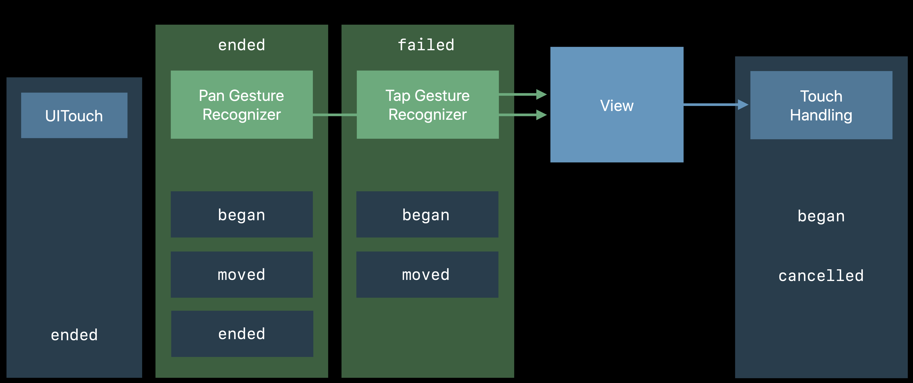
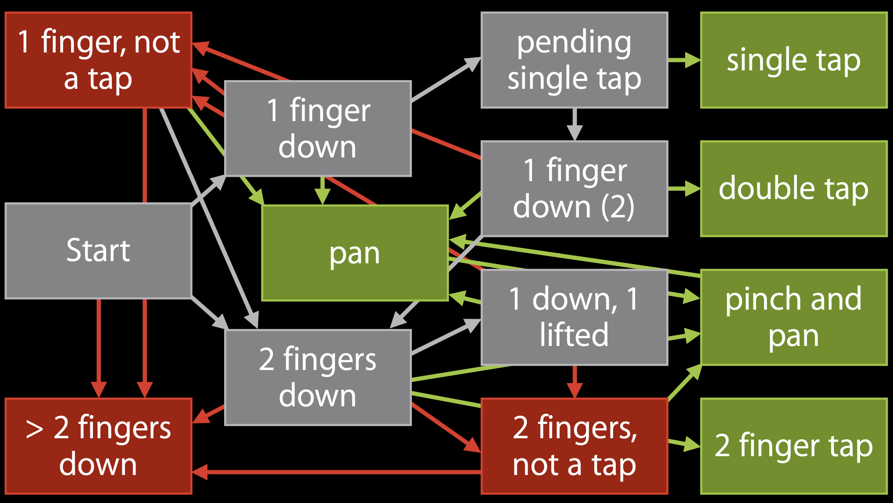
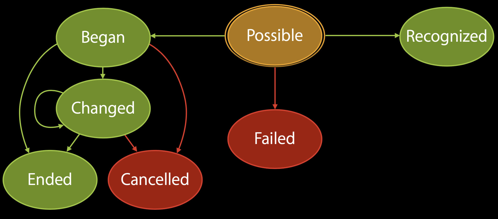
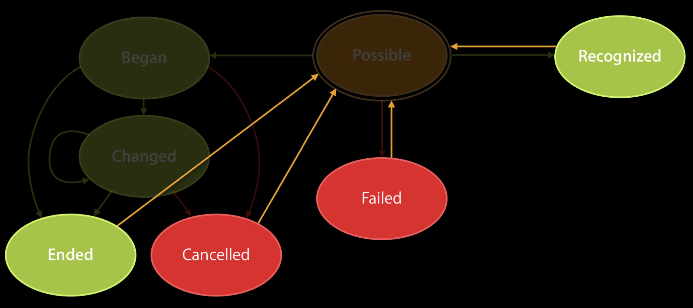
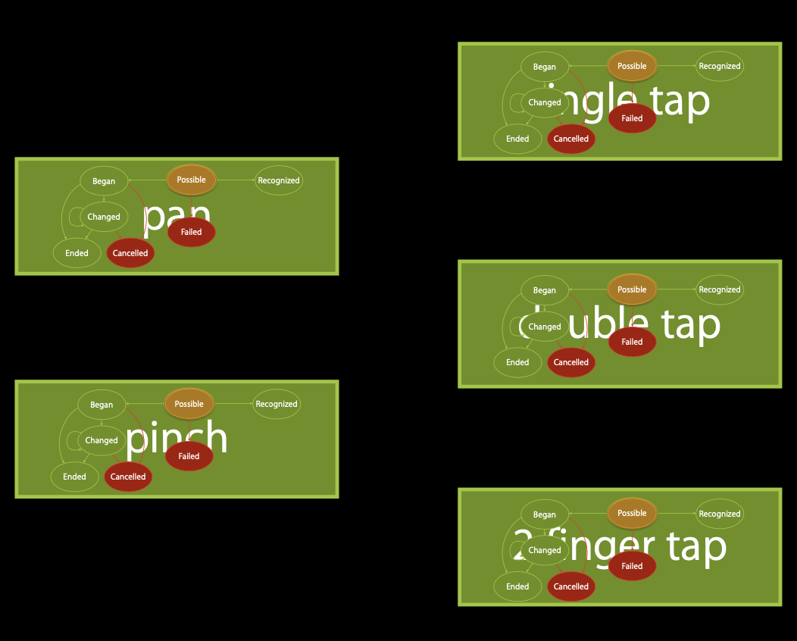
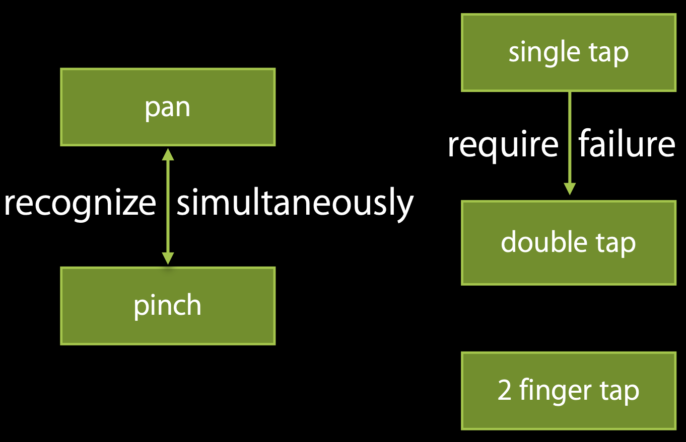
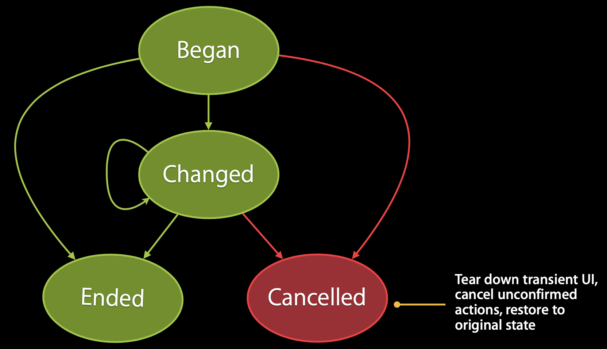

# iOS 手势学习

## 本文要解答的几个问题 

1. Touch 事件是怎么传递的?
1. CASE: 父 View A 有子 View B 和 C, B 和 C frame 一样, 如果需要 B 的左半边和 C 的右半边都能响应点击, 需要怎么处理?
1. UITouch 和 UIEvent 是什么关系? 和 UIGestureRecognizer 又是什么关系?
1. Touch, UIControl 和 UIGestureRecognizer 该如何选择?
1. 手势该如何选择?
1. 多个手势会存在冲突吗? 如何处理冲突?
1. 如何自定义手势?
1. ScrollView 中的手势该如何处理?

## Touch 事件是怎么传递的?

### hitTesting 流程

> This method traverses the view hierarchy by calling the pointInside:withEvent: method of each subview to determine which subview should receive a touch event. If pointInside:withEvent: returns YES, then the subview’s hierarchy is similarly traversed until the frontmost view containing the specified point is found. If a view does not contain the point, its branch of the view hierarchy is ignored. You rarely need to call this method yourself, but you might override it to hide touch events from subviews.

> This method ignores view objects that are hidden, that have disabled user interactions, or have an alpha level less than 0.01. This method does not take the view’s content into account when determining a hit. Thus, a view can still be returned even if the specified point is in a transparent portion of that view’s content.

> Points that lie outside the receiver’s bounds are never reported as hits, even if they actually lie within one of the receiver’s subviews. This can occur if the current view’s clipsToBounds property is set to NO and the affected subview extends beyond the view’s bounds.

hitTest 采用的是"逆前序深度遍历", 从最底部的 window 开始遍历, 具体伪代码如下:

```
- (UIView *)hitTest:(CGPoint)point withEvent:(UIEvent *)event { 
    if (/* point is in our bounds */) {
        for (/* each subview, in reverse order */) {
            UIView *hitView = /* recursive call on subview */
            if (hitView != nil) {
                return hitView;
            } 
        }
        return self; 
    }
    return nil; 
}
```

那么 hitTest 方法找到的是最顶层可以响应事件的子 View, 后续事件会派发给该 View.

### 点击响应区域处理

从上面的伪代码可以看到, 最开始的判断就是 `point is in our bounds` 的逻辑, 那么这个对应到 UIView 中的方法是:

```
- (BOOL)pointInside:(CGPoint)point withEvent:(UIEvent *)event {
    /* point is in our bounds */
}
```

### 其他相关属性

```

@property(nonatomic,getter=isUserInteractionEnabled) BOOL userInteractionEnabled;  // default is YES. if set to NO, user events (touch, keys) are ignored and removed from the event queue.
@property(nonatomic,getter=isHidden) BOOL              hidden;                     // default is NO. doesn't check superviews
@property(nonatomic)                 CGFloat           alpha;                      // animatable. default is 1.0
@property(nonatomic,getter=isMultipleTouchEnabled) BOOL multipleTouchEnabled API_UNAVAILABLE(tvos);   // default is NO

typedef NS_OPTIONS(NSUInteger, UIViewAnimationOptions) {
    // ...
    UIViewAnimationOptionAllowUserInteraction      = 1 <<  1, // turn on user interaction while animating
    // ...
}

```

#### 解决问题 2

可以利用 `- (BOOL)pointInside:(CGPoint)point withEvent:(UIEvent *)event` 方法解决,
对应的可以参考 `TDTouchViewController` 中的例子, 解决了问题 2 中的 CASE.

### 事件分发流程

**发送事件**  


**响应者链**  


### 以 Single Touch 为例

**touch down**  


**touch began**  


**touch moves**  


**touch ended**  


**touch cancelled**  


**summary**  


### 加入手势以后

**touch down**  


**touch began**  


**touch move**  


**touch move again**  


**touch lift**  


### 多手势



## 为什么需要手势? 

### Touch 能否满足手势要求?

#### Touch 的优点
1. API 简单
2. 满足一般的点击需求

#### Touch 的劣势
1. 准确度限制
2. 同时发生多个点击时难以处理
3. 对于手势规则判断的不确定性
   - Tap
   - Double-Tap
   - Pan
   - Long Press
   - Tap-and-a-half
   - ...
4. 中间状态难以处理
   - Wait
   - Guess
   - Give up

可以感受下下图:

**touch problem**


### Gesture Recognizer 的优势

#### Gesture Recognizer 采用状态机的设计

采用状态机的设计, 准确定义手势的不同阶段的状态, 便于管理





#### Gesture Recognizer 的状态机互相独立, 各自管理



#### Gesture Recognizer 可以进行冲突管理



### 手势开启

```
@protocol UIGestureRecognizerDelegate <NSObject>
@optional
// called when a gesture recognizer attempts to transition out of UIGestureRecognizerStatePossible. returning NO causes it to transition to UIGestureRecognizerStateFailed
- (BOOL)gestureRecognizerShouldBegin:(UIGestureRecognizer *)gestureRecognizer;

// called before touchesBegan:withEvent: is called on the gesture recognizer for a new touch. return NO to prevent the gesture recognizer from seeing this touch
- (BOOL)gestureRecognizer:(UIGestureRecognizer *)gestureRecognizer shouldReceiveTouch:(UITouch *)touch;

// ...
@end


@property(nonatomic, getter=isEnabled) BOOL enabled;  // default is YES. disabled gesture recognizers will not receive touches. when changed to NO the gesture recognizer will be cancelled if it's currently recognizing a gesture

@property(nonatomic, copy) NSArray<NSNumber *> *allowedTouchTypes API_AVAILABLE(ios(9.0)); // Array of UITouchTypes as NSNumbers.

// Indicates whether the gesture recognizer will consider touches of different touch types simultaneously.
// If NO, it receives all touches that match its allowedTouchTypes.
// If YES, once it receives a touch of a certain type, it will ignore new touches of other types, until it is reset to UIGestureRecognizerStatePossible.
@property (nonatomic) BOOL requiresExclusiveTouchType API_AVAILABLE(ios(9.2)); // defaults to YES
```

### 手势的状态

`@property(nonatomic,readonly) UIGestureRecognizerState state;`

1. 只用来标记的状态
 - UIGestureRecognizerStatePossible 
 - UIGestureRecognizerStateFailed

2. 非连续的状态
 - UIGestureRecognizerStateRecognized

3. 连续性的状态
 - UIGestureRecognizerStateBegan
 - UIGestureRecognizerStateChanged
 - UIGestureRecognizerStateEnded
 - UIGestureRecognizerStateCancelled

*正常结束*


*取消*



### Demo

下面我们来看下几个手势的例子

#### CASE1: Single Tap, Double Tap, LongPress

参考 TDTapGestureViewController

#### CASE2: Single Tap, Pinch 

参考 TDMutiGestureViewController

#### CASE3: Pan, Pinch

参考 TDPanPinchViewController

## Touch, UIControl 和 UIGestureRecognizer 该如何选择

### Touch

简单的点击事件可以使用 Touch 处理. 鉴于 View 中的 Touch 方法可能会被手势 Cancelled 掉, 一般建议优先使用 UIControl 或者手势.

### UIControl

UIKit 提供了比较丰富的 UIControl 子类控件, 基本可以满足日常开发需求. 

UIButton, UIPageControl, UISegmentedControl, UIStepper (Prevents single taps using one finger)  
以上控件会拦截掉单指的单击手势

UISlider (Prevents swipes and pans using one finger)  
以上控件会拦截掉单指的 swipe 和 pan 手势

UIControl 有个好处, 点击或者滑动后, 对应的 UI 可以进行更新, 以达到良好的交互体验.

### UIGestureRecognizer

常用的有几下几类:

- UITapGestureRecognizer
- UIPanGestureRecognizer
- UIRotationGestureRecognizer
- UIPinchGestureRecognizer
- UILongPressGestureRecognizer
- UISwipeGestureRecognizer

手势不提供 UI 支持, 所以对于不同的状态, 我们可能需要自己去处理 UI 更新. 

## 手势冲突处理

### 主动调用方法

```
// 如果不加这一行, 双击的时候会同时触发单击手势
[_singleTap requireGestureRecognizerToFail:_doubleTap];
```

### 代理方法处理

```
// called once per attempt to recognize, so failure requirements can be determined lazily and may be set up between recognizers across view hierarchies
// return YES to set up a dynamic failure requirement between gestureRecognizer and otherGestureRecognizer
//
// note: returning YES is guaranteed to set up the failure requirement. returning NO does not guarantee that there will not be a failure requirement as the other gesture's counterpart delegate or subclass methods may return YES
- (BOOL)gestureRecognizer:(UIGestureRecognizer *)gestureRecognizer shouldRequireFailureOfGestureRecognizer:(UIGestureRecognizer *)otherGestureRecognizer API_AVAILABLE(ios(7.0)) {
    
    if ([gestureRecognizer isKindOfClass:[TDTapGestureRecognizer class]] &&
        [otherGestureRecognizer isKindOfClass:[TDTapGestureRecognizer class]]) {
        
        if ([(TDTapGestureRecognizer *)gestureRecognizer numberOfTapsRequired] == 1 &&
            [(TDTapGestureRecognizer *)otherGestureRecognizer numberOfTapsRequired] > 1) {
            return YES;
        }
        
    }
    
    return NO;
}
```

### 子类方法处理

```
#pragma mark - Preventing exclusion

/// Overriding these methods enables the same behavior as implementing the UIGestureRecognizerDelegate methods gestureRecognizerShouldBegin: and gestureRecognizer:shouldReceiveTouch:. However, by overriding them, subclasses can define class-wide prevention rules. For example, a UITapGestureRecognizer object never prevents another UITapGestureRecognizer object with a higher tap count.
- (BOOL)canPreventGestureRecognizer:(UIGestureRecognizer *)preventedGestureRecognizer {
    if ([preventedGestureRecognizer isKindOfClass:[TDSimpleTapGestureRecognizer class]] &&
        preventedGestureRecognizer.numberOfTouches > self.numberOfTapsRequired) {
        return NO;
    }
    return YES;
}

/// Overriding these methods enables the same behavior as implementing the UIGestureRecognizerDelegate methods gestureRecognizerShouldBegin: and gestureRecognizer:shouldReceiveTouch:. However, by overriding them, subclasses can define class-wide prevention rules. For example, a UITapGestureRecognizer object never prevents another UITapGestureRecognizer object with a higher tap count.
- (BOOL)canBePreventedByGestureRecognizer:(UIGestureRecognizer *)preventingGestureRecognizer {
    return YES;
}
```

## 如何自定义手势

一个简单示例可以参考: TDSimpleTapGestureRecognizer

稍微复杂点的示例参考: MDCircleGestureRecognizer

## ScrollView 中的手势该如何处理?

ScrollView 中自带 pan 手势, 那么 ScrollView 中常见的手势冲突就是 pan 手势的冲突, 导致滚动异常.
这里可以简单的看一下 ScrollView 嵌套的例子: TDScrollViewController
这个示例只是简单的给个思路, 更多的实践需要根据项目中的实际情况采用上述手势冲突的解决方式进行调整.

另一个例子 WWDC 2014 的官方 Demo, 在 WWDC2014-235 目录中, 这个 Demo 比较完整的展示了 ScrollView 中手势的处理. 

## 总结

至此, 开头提到的大部分问题已经有了比较好的答案. 我们也对 iOS 的手势处理有了进一步的了解. 当然实际项目中可能遇到的场景更为复杂, 这个就具体情况具体分析了.
本次分享中的大部分内容, 历届 WWDC 都有提及, 而且 WWDC 讲解的更为透彻, 文后我会放出链接.

### WWDC 链接

#### WWDC 2010

Simplifying Touch Event Handling with Gesture Recognizers · Session 120 

- HD: https://developer.apple.com/devcenter/download.action?path=/videos/wwdc_2010__hd/session_120__simplifying_touch_event_handling_with_gesture_recognizers.mov
- SD: https://developer.apple.com/devcenter/download.action?path=/videos/wwdc_2010__sd/session_120__simplifying_touch_event_handling_with_gesture_recognizers.mov
- PDF: https://developer.apple.com/devcenter/download.action?path=/wwdc_2010/wwdc_2010_video_assets__pdfs/120__simplifying_touch_event_handling_with_gesture_recognizers.pdf

Advanced Gesture Recognition · Session 121

- HD: https://developer.apple.com/devcenter/download.action?path=/videos/wwdc_2010__hd/session_121__advanced_gesture_recognition.mov
- SD: https://developer.apple.com/devcenter/download.action?path=/videos/wwdc_2010__sd/session_121__advanced_gesture_recognition.mov
- PDF: https://developer.apple.com/devcenter/download.action?path=/wwdc_2010/wwdc_2010_video_assets__pdfs/121__advanced_gesture_recognition.pdf

#### WWDC 2011

Making the Most of Multi-Touch on iOS · Session 118
- HD: https://developer.apple.com/devcenter/download.action?path=/videos/wwdc_2011__hd/session_118__making_the_most_of_multitouch_on_ios.m4v
- PDF: https://developer.apple.com/devcenter/download.action?path=/wwdc_2011/adc_on_itunes__wwdc11_sessions__pdf/118_making_the_most_of_multitouch_on_ios.pdf

#### WWDC 2012

Building Advanced Gesture Recognizers : https://developer.apple.com/videos/play/wwdc2012/233/

#### WWDC 2014

这个是 WWDC 2014 Session 235 的议题, 在线视频已经没有了, 但是还可以下载到, 以下是链接:

- [235_hd_advanced_scrollviews_and_touch_handling_techniques.mov](https://devstreaming-cdn.apple.com/videos/wwdc/2014/235xxsugqo8pxak/235/235_hd_advanced_scrollviews_and_touch_handling_techniques.mov?dl=1)
- [235_sd_advanced_scrollviews_and_touch_handling_techniques.mov](https://devstreaming-cdn.apple.com/videos/wwdc/2014/235xxsugqo8pxak/235/235_sd_advanced_scrollviews_and_touch_handling_techniques.mov?dl=1)
- [235_advanced_scrollviews_and_touch_handling_techniques.pdf](https://devstreaming-cdn.apple.com/videos/wwdc/2014/235xxsugqo8pxak/235/235_advanced_scrollviews_and_touch_handling_techniques.pdf?dl=1)

#### WWDC 2017

Modern User Interaction on iOS : https://developer.apple.com/videos/play/wwdc2017/219/

* * *
- - -

## 番外

准备此处分享的过程中, 也是经过了一些"坎坷", 这里大概梳理下, 以后再次准备类似分享的时候可以规避掉此类问题.

### 过于发散

一开始对于分散的内容过于发散, 不仅想从源头开始分析点击的原理, 也想把整个手势分析透彻, 还要结合到具体的场景去展示各种 CASE.
其实对于一场分享, 因为时间有限 (无论是分享者还是听众), 聚焦一些内容还是有必要的. 如果内容过多可以分多次分享.

### 无从下手

基于第一点, 由于过于发散, 前期需要准备的素材过多, 包括 WWDC 的视频, 现有的博客, Github 源码, Demo 的编写, 每一项都需要花费不少的时间.

### 到哪为止

分享到什么程度也是个问题, 过细需要花费的时间很多, 过粗可能内容又没什么干货, 如何做的具有启发性, 听众能够根据你的思路去解决现有的问题, 这个度也需要拿捏的比较好.

### 焦虑

其实到后期还是有些焦虑的, 总觉的遗漏了很多东西, 很多东西自己还没有理解透彻怎么去给别人讲, Demo 写的比较粗糙, 文档写的不够完善等等. 
其实源头还是没有聚焦. 下面分享下自己走过的弯路, 对于系统源码的一些分析.

## Tips

### lldb 打印 

#### 方法断点入口打印

```
po $arg1  // 调用对象
po (SEL)$arg2 // 方法签名
po $arg3 // 第一个参数
po $arg4 // 第二个参数
... // 以此类推
```

#### 系统方法汇编代码点断打印
对于系统方法执行过程中, 想要对某些方法体内部的方法进行调用的话, 可以直接对汇编代码进行断点, 然后打印寄存器中的变量.
参考: [汇编基础（通用寄存器）](https://www.jianshu.com/p/842fbda059e1)
- 第一个参数: RDI
- 第二个参数: RSI
- 第三个参数: RDX
- 第四个参数: RCX
- 第五个参数: R8
- 第六个参数: R9
- 超过7个以及上的参数会被分配到进程的栈区
- 返回值: RAX

所以使用 po 进行查看, 入参查看, 断点在 `callq` 之前:

```
po $rdi // 第一个参数
po (SEL)$rsi // 第二个参数
... // 以此类推
```

返回值查看, 断点在 `callq` 下一行:

```
po $rax // 查看返回值
```

## 源码

- 目前 RunLoop 的源码参考的: https://github.com/apple/swift-corelibs-foundation
- 汇编代码主要逆向的 UIKitCore

## iOS 手势原生响应机制处理流程

在 com.apple.uikit.eventfetch-thread 线程下苹果注册了一个 Source1(基于 mach port 的)用来接收系统事件, 其回调函数为 __IOHIDEventSystemClientQueueCallback()，"HID" 是 Human Interface Devices "人机交互" 的首字母缩写.
当一个硬件事件(触摸/锁屏/摇晃等)发生后, 首先由 IOKit.framework 生成一个 IOHIDEvent 事件并由 SpringBoard 接收. 这个过程的详细情况可以参考 [IOHIDFamily](http://iphonedevwiki.net/index.php/IOHIDFamily). 
SpringBoard 只接收按键(锁屏/静音等), 触摸, 加速, 接近传感器等几种 Event. 随后用 mach port 转发给需要的 App 进程. 随后苹果注册的那个 Source1 就会触发回调, 并调用 _UIApplicationHandleEventQueue 进行应用内部的分发(Xcode 12 和 iOS 14 下是：__eventQueueSourceCallback).
_UIApplicationHandleEventQueue 会把 IOHIDEvent 处理并包装成 UIEvent 进行处理或分发，其中包括识别 UIGesture/处理屏幕旋转/发送给 UIWindow 等, 通常事件比如 UIButton 点击,touchesBegin/Move/End/Cancel 事件都是在这个回调中完成的. [深入理解RunLoop](https://blog.ibireme.com/2015/05/18/runloop/)

### com.apple.uikit.eventfetch-thread 线程

```
-[UIEventFetcher threadMain] // 方法会单起了一个线程, 该线程有自己的 RunLoop, 是一个常驻线程, Xcode Debug 模式下可以挂起线程进行测试, 所有的点击事件都不响应了.  
IOHIDEventSystemClientScheduleWithRunLoop // 启动 RunLoop  
IOHIDEventSystemClientRegisterEventCallback // 注册回调  
-[UIEventFetcher _setupFilterChain] // 设置 __UILogGetCategoryImpl  
```

### 点击触发 Source1

#### 起点分析

Source1 是基于 mach port 的, 用来接收系统事件. 
从 RunLoop 源码分析应该是 __CFRunLoopModeFindSourceForMachPort 触发的, 但是断点并没有执行.

```
// call with rl and rlm locked
static CFRunLoopSourceRef __CFRunLoopModeFindSourceForMachPort(CFRunLoopRef rl, CFRunLoopModeRef rlm, __CFPort port) {	/* DOES CALLOUT */
    CHECK_FOR_FORK();
    CFRunLoopSourceRef found = rlm->_portToV1SourceMap ? (CFRunLoopSourceRef)CFDictionaryGetValue(rlm->_portToV1SourceMap, (const void *)(uintptr_t)port) : NULL;
    return found;
}
```

从其上一步 CFDictionaryGetValue 调用分析, 都是通过 port 取 CFRunLoopSource, 和 __CFRunLoopModeFindSourceForMachPort 实现一致, 初步推测可能是编译器给优化掉了, 但是实现并没有变:

```
断点 CFDictionaryGetValue 函数, 取 $arg1 (即字典本身), 取 allValues:
<__NSArrayI_Transfer 0x283d96d00>(
<CFRunLoopSource 0x2808a0540 [0x1ea4f5b20]>{signalled = No, valid = Yes, order = 0, context = <CFMachPort 0x280aa42c0 [0x1ea4f5b20]>{valid = Yes, port = 480f, source = 0x2808a0540, callout = <redacted> (0x1a3575770), context = <CFMachPort context 0x125e056d0>}},
<CFRunLoopSource 0x2808a0600 [0x1ea4f5b20]>{signalled = No, valid = Yes, order = 0, context = <CFMachPort 0x280aa4370 [0x1ea4f5b20]>{valid = Yes, port = 3807, source = 0x2808a0600, callout = <redacted> (0x1a3575930), context = <CFMachPort context 0x125e056d0>}},
<CFRunLoopSource 0x2808a06c0 [0x1ea4f5b20]>{signalled = No, valid = Yes, order = 1, context = <CFMachPort 0x280aa0160 [0x1ea4f5b20]>{valid = Yes, port = 3203, source = 0x2808a06c0, callout = <redacted> (0x1a358ba48), context = <CFMachPort context 0x2816a2290>}}
)
```

打印 $arg2 port 值为 18447 转化成 16进制 = 0x480F, 在字典中能够找到:

```
(lldb) p $arg2
(unsigned long) $14 = 18447
``` 

#### 触发 Source1

```
__CFRunLoopDoSource1
    __CFRUNLOOP_IS_CALLING_OUT_TO_A_SOURCE1_PERFORM_FUNCTION__
        __CFMachPortPerform
```

#### Source1 转 Source0

```
__IOHIDEventSystemClientQueueCallback // 回调处理
    -[UIEventFetcher _receiveHIDEventInternal:] // 接收事件
    (lldb) po $arg3
    +++++++++++++++++++++++++++++++++++++++++++++++++++++++++++++++++++++++++++
    SenderID:            0x0acefade00000002
    BuiltIn:             1
    PrimaryUsagePage:    13
    PrimaryUsage:        4
    DeviceUsagePairs:   
    DeviceUsagePage:     13
    DeviceUsage:         4
    +++++++++++++++++++++++++++++++++++++++++++++++++++++++++++++++++++++++++++

    (lldb) po [$arg3 class]
    HIDServiceClient // 这里可以看出 HID 事件处理应该是个 C/S 架构

    __30-[UIEventFetcher filterEvents]_block_invoke // 过滤事件

    -[UIEventFetcher signalEventsAvailableWithReason:filteredEventCount:] // 发送事件

    -[UIEventDispatcher eventFetcherDidReceiveEvents:] // 派发事件, 入参是 UIEventFetcher
    (lldb) po $arg3
    <UIEventFetcher: 0x60000074c100>

    // 查看汇编代码, 可以得到, 最终在这个函数里面将 Source1 转化为了 Source0
    void -[UIEventDispatcher eventFetcherDidReceiveEvents:](int arg0) {
            CFRunLoopSourceSignal(*(arg0 + 0x20));
            CFRunLoopWakeUp(*(arg0 + 0x28));
            return;
    }
```

### 主线程

#### 处理 Source0

主线程 RunLoop 被唤醒后, 开始处理 Source0

```
__CFRunLoopDoSource0
    __CFRUNLOOP_IS_CALLING_OUT_TO_A_SOURCE0_PERFORM_FUNCTION__
        __eventFetcherSourceCallback
            -[UIEventFetcher drainEventsIntoEnvironment:] // 入参 UIEventEnvironment, 参考 https://github.com/w0lfschild/macOS_headers/blob/master/macOS/PrivateFrameworks/UIKitCore/61000/UIEventEnvironment.h
            __processEventQueue // 关键函数
```

#### 确定响应事件的 View

整个主要的逻辑都在 __processEventQueue 里面, 通过汇编查看这个函数体非常的大, 也很复杂, 主要挑几个重点看一下吧

```
-[UIEventEnvironment UIKitEventForHIDEvent:] // 会将 HIDEvent 转成 UITouchesEvent
``` 

```
_UIEventHIDUIWindowForHIDEvent // 通过 HIDEvent 获取处理该事件的 Window, 可以断点在调用处的下一行查看返回值
(lldb) po $rax
<TDWindow: 0x7fe03140aec0; baseClass = UIWindow; frame = (0 0; 428 926); gestureRecognizers = <NSArray: 0x60000185a610>; layer = <UIWindowLayer: 0x60000165cb40>>
```

```
_UIEventHIDEnumerateChildren // 遍历子事件 (log 中的 ChildEvents), 该函数有三个参数, 遍历出子事件后交由 ____updateTouchesWithDigitizerEventAndDetermineIfShouldSend_block_invoke 处理
(lldb) po $arg1
+++++++++++++++++++++++++++++++++++++++++++++++++++++++++++++++++++++++
Timestamp:           37267037826054
Total Latency:       1883854716 us
SenderID:            0x0ACEFADE00000002 NON KERNEL SENDER
BuiltIn:             1
AttributeDataLength: 120
AttributeData:       02 00 00 00 69 00 00 00 0a 59 0d 00 00 00 00 11 00 00 00 00 00 00 00 00 19 00 00 00 00 00 00 00 00 21 1c fc de 35 61 32 e2 40 28 01 30 00 38 00 42 31 08 01 10 35 18 00 20 00 2d 00 00 00 00 31 aa aa aa aa aa 0a 6f 40 39 55 55 55 55 55 5d 83 40 41 aa aa aa aa aa 0a 6f 40 49 55 55 55 55 55 5d 83 40 12 0c 22 06 08 b6 ea 9d 86 01 28 00 30 00 00 00 00 00 00 00 00 
ValueType:           Absolute
EventType:           Digitizer
Flags:               0xa0015
DisplayIntegrated:   1
TransducerType:      Hand
TransducerIndex:     0
Identity:            0
EventMask:           2
Events:              Touch 
ButtonMask:          0
Range:               0
Touch:               1
Pressure:            0.000000
AuxiliaryPressure:   0.000000
Twist:               0.000000
GenerationCount:     0
WillUpdateMask:      00000000
DidUpdateMask:       00000000
X:                   0.000000
Y:                   0.000000
Z:                   0.000000
TiltX:               0.000000
TiltY:               0.000000
ChildEvents:        
    -----------------------------------------------------------------------
    ValueType:           Absolute
    EventType:           Digitizer
    Flags:               0xb0001
    DisplayIntegrated:   1
    TransducerType:      Finger
    TransducerIndex:     1
    Identity:            2
    EventMask:           3
    Events:              Range Touch     
    ButtonMask:          0
    Range:               1
    Touch:               1
    Pressure:            0.000000
    AuxiliaryPressure:   0.000000
    Twist:               90.000000
    GenerationCount:     0
    WillUpdateMask:      00000000
    DidUpdateMask:       00000000
    X:                   248.333328
    Y:                   619.666656
    Z:                   0.000000
    Quality:             1.500000
    Density:             1.500000
    Irregularity:        0.000000
    MajorRadius:         4.599991
    MinorRadius:         3.799988
    Accuracy:            0.000000
    -----------------------------------------------------------------------
+++++++++++++++++++++++++++++++++++++++++++++++++++++++++++++++++++++++

(lldb) po $arg2
11

(lldb) po $arg3
<__NSStackBlock__: 0x7ffeef625478>
 signature: "v32@?0^{__IOHIDEvent=}8Q16^B24"
 invoke   : 0x7fff2473c958 (/Applications/Xcode.app/Contents/Developer/Platforms/iPhoneOS.platform/Library/Developer/CoreSimulator/Profiles/Runtimes/iOS.simruntime/Contents/Resources/RuntimeRoot/System/Library/PrivateFrameworks/UIKitCore.framework/UIKitCore`____updateTouchesWithDigitizerEventAndDetermineIfShouldSend_block_invoke)
 copy     : 0x7fff23cece6b (/Applications/Xcode.app/Contents/Developer/Platforms/iPhoneOS.platform/Library/Developer/CoreSimulator/Profiles/Runtimes/iOS.simruntime/Contents/Resources/RuntimeRoot/System/Library/PrivateFrameworks/UIKitCore.framework/UIKitCore`__copy_helper_block_e8_32r40r)
 dispose  : 0x7fff23cecea3 (/Applications/Xcode.app/Contents/Developer/Platforms/iPhoneOS.platform/Library/Developer/CoreSimulator/Profiles/Runtimes/iOS.simruntime/Contents/Resources/RuntimeRoot/System/Library/PrivateFrameworks/UIKitCore.framework/UIKitCore`__destroy_helper_block_e8_32r40r)
```

其他一些调用:

```
-[UIEventEnvironment _setTouchMap:forWindow:] // 将 UITouch 缓存到当前 Window 中, 下面事件分发的时候需要使用
-[UITouch _willBeDispatchedAsEnded] // 点击为 end 状态时会触发
[[_UIRemoteKeyboards sharedRemoteKeyboards] peekApplicationEvent:] // 发送给键盘的 Window 进行处理
BKSHIDEventGetSystemGestureStatusFromDigitizerEvent // 获取系统手势状态
__sendSystemGestureLatentClientUpdate // 系统手势更新
```

#### 事件分发

```
// 先由 UIApplication sendEvent:
- [UIApplication sendEvent:]

// 调用 UIWindow sendEvent:
- [UIWindow sendEvent:]
    -[UIWindow _sendTouchesForEvent:]
        -[UITouchesEvent _viewsForWindow:] // 获取 Touch 的 View
            -[UITouchesEvent touchesForWindow:] // 从 _keyedTouchesByWindow 这个字典里面获取 UITouch, key 是 Window, Value 是 Touch, 如果能取到 Touch, 走下面的方法
        -[UITouchesEvent _touchesForView:withPhase:] 
            -[UITouchesEvent touchesForView:] // 从 _keyedTouches 字典里面获取 UITouch
        // ...
        // 通过上面获取的 View & Touch 调用 touchesBegan/touchesMoved/touchesEnded/touchesCancelled 等方法
```

## hitTest 流程分析

以下是 hitTest 方法触发的调用栈:

```
____updateTouchesWithDigitizerEventAndDetermineIfShouldSend_block_invoke.43
    -[UIWindow _targetWindowForPathIndex:atPoint:forEvent:windowServerHitTestWindow:]
        +[UIWindow _hitTestToPoint:forEvent:windowServerHitTestWindow:]
            -[UIWindowScene _topVisibleWindowPassingTest:]
                -[UIWindowScene _enumerateWindowsIncludingInternalWindows:onlyVisibleWindows:asCopy:stopped:withBlock:]
                    __46-[UIWindowScene _topVisibleWindowPassingTest:]_block_invoke
                        __63+[UIWindow _hitTestToPoint:forEvent:windowServerHitTestWindow:]_block_invoke
                            -[UIWindow _hitTestLocation:inScene:withWindowServerHitTestWindow:event:]
                                -[UIView(Geometry) _hitTest:withEvent:windowServerHitTestWindow:]
                                    -[UIView(Geometry) hitTest:withEvent:]
```

我们先从汇编代码看下 hitTest 方法的主要核心代码如下:

```
if (__UIViewIgnoresTouchEvents(r13, rbx & 0xff) == 0x0) {
        xmm0 = intrinsic_movsd(xmm0, var_30);
        intrinsic_movsd(xmm1, var_38);
        if ([r13 pointInside:r14 withEvent:___Block_byref_object_dispose_] != 0x0) {
                rax = *ivar_offset(_viewFlags);
                rsi = 0x0;
                r15 = 0x400 & *(r13 + rax);
                if (r15 == 0x0) {
                        rsi = r13;
                }
                objc_storeStrong(var_68 + 0x28, rsi);
                rax = [r13 subviews];
                rax = [rax retain];
                var_C0 = *__NSConcreteStackBlock;
                *(&var_C0 + 0x8) = 0xffffffffc2000000;
                *(&var_C0 + 0x10) = ___38-[UIView(Geometry) hitTest:withEvent:]_block_invoke;
                *(&var_C0 + 0x18) = ___block_descriptor_73_e8_32s40s48r_e15_v32?08Q16^B24l;
                *(int8_t *)(&var_C0 + 0x48) = r15 >> 0xa;
                *(&var_C0 + 0x20) = [r14 retain];
                xmm0 = intrinsic_movsd(xmm0, var_30);
                *(&var_C0 + 0x38) = intrinsic_movsd(*(&var_C0 + 0x38), xmm0);
                *(&var_C0 + 0x40) = intrinsic_movsd(*(&var_C0 + 0x40), intrinsic_movsd(xmm0, var_38));
                *(&var_C0 + 0x28) = r13;
                *(&var_C0 + 0x30) = r12;
                [rax enumerateObjectsWithOptions:0x2 usingBlock:&var_C0];
                [rax release];
                [var_A0 release];
        }
}
```

1. 如果 `__UIViewIgnoresTouchEvents` 判断 View 忽略事件, 则不处理
2. `- (BOOL)pointInside:(CGPoint)point withEvent:(UIEvent *)event` 判断点击是否在 View 内
3. 遍历 subviews 调用 `___38-[UIView(Geometry) hitTest:withEvent:]_block_invoke`
4. `___38-[UIView(Geometry) hitTest:withEvent:]_block_invoke` 会再调用 `-[UIView(Geometry) _hitTest:withEvent:windowServerHitTestWindow:]` 方法
5. `-[UIView(Geometry) _hitTest:withEvent:windowServerHitTestWindow:]` 内会再调用子 View 的 `hitTest:withEvent:` 方法
6. 如上, 重复此过程, 最终遍历到符合条件的 View 并返回

**这里有个细节: hitTest 采用的是"逆前序深度遍历".**

## 手势的处理

这里以 Tap 手势为例, 同样的主要的逻辑处理在 `__processEventQueue` 函数里面

```
____updateTouchesWithDigitizerEventAndDetermineIfShouldSend_block_invoke.100
    _AddTouchToEventAndDetermineIfNeedsCancel
        -[UITouchesEvent _addTouch:forDelayedDelivery:]
            -[UITouchesEvent _addGestureRecognizersForView:toTouch:]
                -[UITouchesEvent _addGestureRecognizersForView:toTouch:forContinuation:]
                    -[UITouchesEvent _collectGestureRecognizersForView:withBlock:]
                        __62-[UITouchesEvent _collectGestureRecognizersForView:withBlock:]_block_invoke
                            __72-[UITouchesEvent _addGestureRecognizersForView:toTouch:forContinuation:]_block_invoke
                                -[UIGestureRecognizer _shouldReceiveTouch:forEvent:recognizerView:]
```

### UITouch 和手势的关系

UITouch 会持有手势, 具体是在 `-[UITouchesEvent _addGestureRecognizersForView:toTouch:]` 方法里面添加进去的

我们先获取 UITouch 的地址

```
(lldb) p $arg4
(unsigned long) $0 = 140359228234352
```

打印下 `gestureRecognizers`, 此时我们看到为空

```
(lldb) po [(UITouch *)140359228234352 gestureRecognizers]
 nil
```

断点执行到 `-[UITouchesEvent _addGestureRecognizersForView:toTouch:forContinuation:]` 方法之后, 再打印 `gestureRecognizers` 已经有值了

```
(lldb) po [(UITouch *)140359228234352 gestureRecognizers]
<__NSArrayI 0x600003601680>(
<TDTapGestureRecognizer: 0x7fa7f0812d00; baseClass = UITapGestureRecognizer; state = Possible; view = <TDView 0x7fa7f0812b90>; target= <(action=tap:, target=<TDGestureViewController 0x7fa7f0814fc0>)>>,
<TDLongPressGestureRecognizer: 0x7fa7f0816070; baseClass = UILongPressGestureRecognizer; state = Possible; view = <TDView 0x7fa7f0812b90>; target= <(action=longPress:, target=<TDGestureViewController 0x7fa7f0814fc0>)>; numberOfTapsRequired = 0; minimumPressDuration =  1>,
<_UIParallaxTransitionPanGestureRecognizer: 0x7fa7edd0c4c0; state = Possible; delaysTouchesBegan = YES; view = <UILayoutContainerView 0x7fa7edd09e30>; target= <(action=handleNavigationTransition:, target=<_UINavigationInteractiveTransition 0x7fa7edd08dd0>)>>,
<_UISystemGestureGateGestureRecognizer: 0x7fa7edd08450; state = Possible; delaysTouchesEnded = NO; view = <TDWindow 0x7fa7edd09b40>>,
<_UISystemGestureGateGestureRecognizer: 0x7fa7edd07ae0; state = Possible; delaysTouchesBegan = YES; view = <TDWindow 0x7fa7edd09b40>>
)
```

那么手势是在什么时候添加到 UITouch 里面的呢? 参考如下调用:

```
__72-[UITouchesEvent _addGestureRecognizersForView:toTouch:forContinuation:]_block_invoke
    -[UITouch _addGestureRecognizer:]
```

### 手势更新

这里以 Pan 手势为例, Pan 手势触发时候的调用栈:

```
-[UIApplication sendEvent:]
    -[UIWindow sendEvent:]
        -[UIGestureEnvironment _updateForEvent:window:]
            _UIGestureEnvironmentUpdate
                -[UIGestureRecognizer _updateGestureForActiveEvents]
                    _UIGestureRecognizerSendActions
                        _UIGestureRecognizerSendTargetActions
                            -[UIGestureRecognizerTarget _sendActionWithGestureRecognizer:]
```

这里有个关键角色 `UIGestureEnvironment`, 首先我们看看 `UIGestureEnvironment` 是个啥. 
先看下 dump 出的头文件: https://developer.limneos.net/?ios=11.1.2&framework=UIKit.framework&header=UIGestureEnvironment.h
这个是 iOS 11.1.2 的头文件, 有些私有方法已经变更了, 不过还是可以大致推测下.
从属性和方法来看, 手势的集中管理就在这个类中.

我们简单验证下, 将以下两个方法加一下断点:
-[UIGestureEnvironment addGestureRecognizer:]
-[UIGestureEnvironment removeGestureRecognizer:]

添加:

```
-[UIView addGestureRecognizer:]
    -[UIView _addGestureRecognizer:atEnd:]
        -[UIGestureEnvironment addGestureRecognizer:]
```

移除:

```
-[UIView dealloc]
    -[UIView(UIViewGestures) removeAllGestureRecognizers]
        -[UIGestureEnvironment removeGestureRecognizer:]
```

按此判断, 手势最终都会在 UIGestureEnvironment 里面进行统一管理. 

从调用栈可知, UIGenerateEnviromonent 需要找出对应的 GestureRecognizer 进行手势处理, 可以看下 hooper 的汇编伪代码:

```
loc_7276d9:
    var_5E8 = objc_opt_new(@class(NSMutableOrderedSet));
    var_600 = @selector(removeAllObjects);
    while ([*(var_628 + 0x10) count] != 0x0) {
            var_600 = @selector(removeAllObjects);
            rax = [*(var_628 + 0x10) allObjects];
            rax = [rax retain];
            r14 = [[rax sortedArrayUsingSelector:@selector(_depthFirstViewCompare:)] retain];
            // ... 以下代码省略
    }
    // ... 以下代码省略
```

其中 var_628 变量就是 UIGestureEnvironment, 偏移 0x10 就是第二个实例变量对应 `_gestureRecognizersNeedingUpdate`, 在对应 `rax = [*(var_628 + 0x10) allObjects];` 代码处断点, 我们打印下

```
(lldb) po $rax
<UIGestureEnvironment: 0x60000144c000>

(lldb) po [$rax valueForKeyPath:@"_gestureRecognizersNeedingUpdate"]
{(
    <_UIParallaxTransitionPanGestureRecognizer: 0x7fbdde7111e0; state = Failed; delaysTouchesBegan = YES; view = <UILayoutContainerView 0x7fbdde70c580>; target= <(action=handleNavigationTransition:, target=<_UINavigationInteractiveTransition 0x7fbdde7110a0>)>>,
    <_UISystemGestureGateGestureRecognizer: 0x7fbdde70e680; state = Possible; delaysTouchesEnded = NO; view = <TDWindow 0x7fbdde70ec40>>,
    <TDPanGestureRecognizer: 0x7fbdde70c070; baseClass = UIPanGestureRecognizer; state = Possible; view = <TDView 0x7fbdde717fa0>; target= <(action=pan:, target=<TDPanViewController 0x7fbdde424bd0>)>>,
    <_UISystemGestureGateGestureRecognizer: 0x7fbdde70b470; state = Failed; delaysTouchesBegan = YES; view = <TDWindow 0x7fbdde70ec40>>
)}
```

中间还会对手势有一些额外的处理, 然后将手势添加到上述的 `NSMutableOrderedSet` 中, 这里不详细讲了, 定位起来也比较麻烦.
然后遍历 `NSMutableOrderedSet` 调用 `-[UIGestureRecognizer _updateGestureForActiveEvents]`

```
rax = [var_5E8 retain];
r14 = rax;
rax = _objc_msgSend_16fe878(rax, var_618, &var_8B0, &var_5B0, 0x10);
r12 = rax;
if (rax != 0x0) {
        r15 = *var_8A0;
        do {
                rbx = 0x0;
                do {
                        if (*var_8A0 != r15) {
                                objc_enumerationMutation(r14);
                        }
                        -[UIGestureRecognizer _updateGestureForActiveEvents](*(var_8A8 + rbx * 0x8));
                        rbx = rbx + 0x1;
                } while (rbx < r12);
                var_618 = @selector(countByEnumeratingWithState:objects:count:);
                rax = (*_objc_msgSend)(r14, var_618);
                r12 = rax;
        } while (rax != 0x0);
}>
```

断点 `_UIGestureRecognizerSendTargetActions` 看下, 连续触发了几次, 其中有 `state = Began` -> `state = Changed` 的转变

Began: 
```
(lldb) po $arg1
<TDPanGestureRecognizer: 0x7fbdde70c070; baseClass = UIPanGestureRecognizer; state = Began; view = <TDView 0x7fbdde717fa0>; target= <(action=pan:, target=<TDPanViewController 0x7fbdde424bd0>)>>
```

Changed: 
```
(lldb) po $arg1
<TDPanGestureRecognizer: 0x7fbdde70c070; baseClass = UIPanGestureRecognizer; state = Changed; view = <TDView 0x7fbdde717fa0>; target= <(action=pan:, target=<TDPanViewController 0x7fbdde424bd0>)>>
```

至此可以大概推测手势更新的一个逻辑
